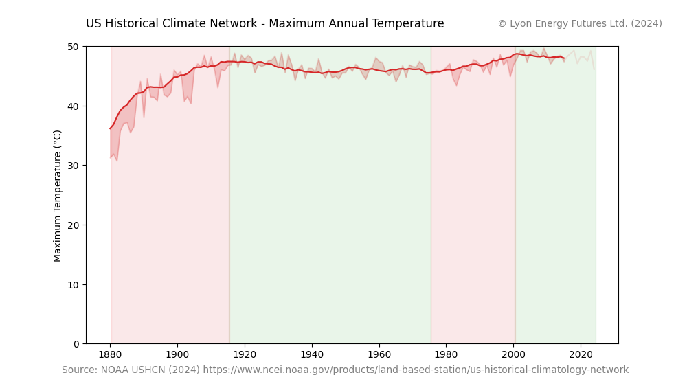

# python-ushcn

The climate catastrophe hypothesis predicts that an increasing atmospheric concentration of
CO2 will produce a catastrophic increase in the earth's temperature.

Has it?

The [U.S. Historical Climatology Network](https://www.ncei.noaa.gov/products/land-based-station/us-historical-climatology-network#:~:text=U.S.%20Historical%20Climatology%20Network%20(USHCN)%20data%20are%20used%20to%20quantify,of%20long%2Dterm%20COOP%20stations) (USHCN) is a dataset managed by the National 
Climatic Data Center (NCDC), which is part of the National Oceanic and Atmospheric 
Administration (NOAA). The USHCN provides high-quality, long-term temperature and 
precipitation data from various weather stations across the United States. This data 
is used to study climate trends and variations over time.

This repository contains a python script for processing USHCN datafiles and plotting that data
to evaluate the claim of an upward trend in temperature.

It will come as no great surprise to many that the data does not support the climate catastrophe hypothesis. 

The period 1850-1920 - predating hydrocarbon era - shows a large warming trend as the climate recovered
from the Little Ice Age. The commencement of hydrocarbon production in the early 20th century has been 
accompanied by a slight cooling trend over the majority of the 20th Century. Overall, there is no systematic warming trend in continental-scale 
maximum temperatures as predicted by the climate catastrophe hypothesis.

## Description

USHCN maintains datafiles of monthly maximum, minimum, and average temperatures for 1,200 weather stations throughout
the US from 1875 to the present date. Each of these is available in three datasets. 'Raw' is the raw data.
'TOB' corrects for variations in the time of day when the temperature is recorded. 'FLS52' attempts to correct for 
sources of contamination, such as urban heat island effect.

Function `utils/process_data.get_data()` gets a Pandas dataframe containing the temperature data
for a specified temperature measurement ('max', 'min', 'avg') and a specified 
dataset ('raw', 'TOB', 'FLS52'). Data columns are a multi-index with the first level being the weather station
and the second the month number. Rows are years. Values are temperature in degrees Celcius.

## Usage

Script `utils/updater.py` loads the latest USHCN datafiles from the USHCN FTP site and saves them to the `data` directory.

Script `plots/max_temps.py` plots the maximum temperatures with a rolling average.

**Licence: MIT**

## Other datasets

* [Long-Term Daily and Monthly Climate Records from Stations Across the Contiguous United States (U.S. Historical Climatology Network)](https://knb.ecoinformatics.org/view/doi%3A10.3334%2FCDIAC%2FCLI.NDP019) Daily data, last updated 2016.
* [NCEI Quality Controlled datasets](https://www.ncei.noaa.gov/access/crn/qcdatasets.html) Selected subsets of monthly, daily, hourly and sub-hourly (5-minute) USCRN/USRCRN data are available as text files