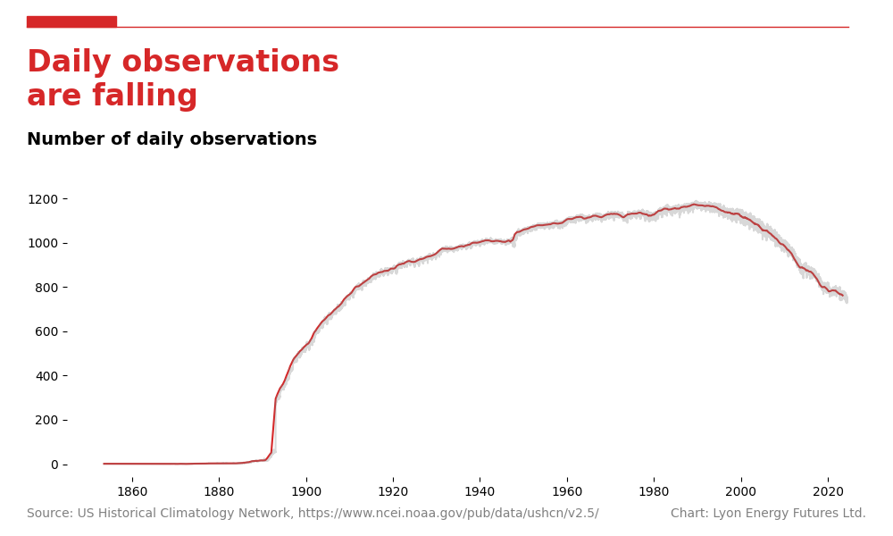

# Are daily observations falling?

**Daily observations are falling.**

Data from the US Historical Climatology Network is used to support the claim that
the weather is changing for the worse. Given the implications of the claim, it's
reasonable to assess the quality of the network.

One way to do this is to look at the number of observations that are made each day.



The number of daily readings peaked around 1995 and are now rapidly declining.

The interesting thing about this is that NOAA still reports data from the stations
that no longer exist. These are phantom readings generated by algorithmically.

## Script

```python
{{include_file('are_observations_falling.py')}}
```